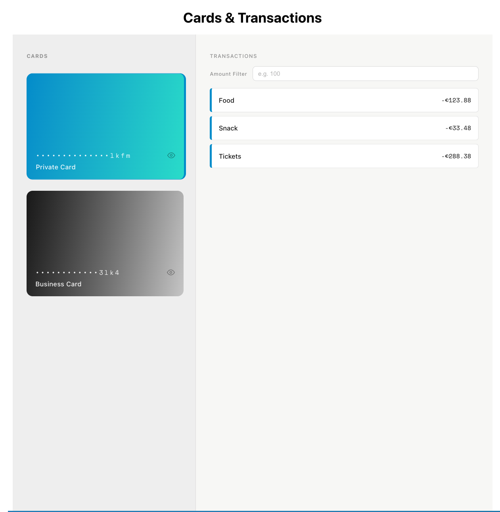

# Cards & Transactions

A banking style overview page built with React and TypeScript. Users can view payment cards, select one, and inspect its transactions with an amount filter that resets on card change.



---

## Getting Started

```bash
yarn          # install dependencies
yarn dev      # start dev server (MSW mocking active)
yarn test     # run tests
yarn build    # production build
```

---

## Approach

### Design & UI

The layout is split into two panels: a sidebar for card selection and a main panel for transactions.

Cards are styled after real payment cards, masked card numbers with a reveal toggle, and a colored right border to indicate the active selection.

Transactions are rendered in a virtualized list (`react-window`) so the UI remains smooth with large datasets. Each transaction row shows a left border matching the selected card's color.

### Architecture

The project follows a two tier component structure:

**`src/lib/`** reusable, context free building blocks, hooks, generic UI components.
Nothing in here knows about cards or transactions.

**`src/components/`** feature components that are project specific, These consume context and business types.

**`src/pages/`** page level layout and data orchestration. `PaymentsPage` fetches cards, sets up providers, and composes the layout.

This separation means the lib folder stays portable and testable in isolation, while the feature components stay focused on product logic.

---

## Assumptions

- **No default selection** no card is selected on load. The transactions panel remains empty until the user picks a card.
- **Visual connection via accent color** the brief says transactions should "visually relate to the selected card". this implemented as a colored left border on each transaction row matching the card's accent color, rather than a full background tint, to keep the list readable.
- **Filter applies to absolute amount** transaction amounts can be negative (refunds/reversals) or positive (charges). We assume negative amounts represent refunds rather than a separate transaction type. The filter threshold is applied to the absolute value so that a refund of -€200 and a charge of €200 are treated equally both are visible when filtering at €200 or below.
- **Card type inferred from description** the API data has no explicit type field. Card type (`Private` / `Business`) is inferred from the `description` string. This is a known fragility, noted in the improvements section.

---

## Key Technical Decisions

### API mocking with MSW

Using [MSW (Mock Service Worker)](https://mswjs.io/) to intercept real `fetch` calls at the network level rather than mocking the API module directly. This means the application code runs exactly as it would in production. Swapping from mock to real API only requires updating `VITE_API_BASE_URL` in the environment file; no application code changes.

MSW also integrates cleanly into Vitest for tests, giving us the same interception behavior in both dev and test environments.

---

### Environment variables

The API base URL lives in `.env.development` (and would live in `.env.production` for a real deployment). This keeps environment specific config out of code.

---

## Data, Store & API

**Types** (`src/types/`) define the shape of domain data (`ICard`, `ITransaction`, `TCardType`). These are the single source of truth shared across API, store, and components.

**API layer** (`src/api/`) contains plain async functions that call `fetch`. just functions that throw on error. Easy to test, easy to replace.

**useFetch** (`src/lib/hooks/useFetch.ts`) is a generic hook that wraps any async function with `loading`/`data`/`error` state. It takes a memoized function reference as input (`useCallback` upstream).

**Store** (`src/store/`) uses React's `useReducer` and `createContext` pattern. The context exposes `selectedCard`, `amountFilter`, and action dispatchers. Values are memoized with `useMemo` to prevent unnecessary rerenders.

**Data flow:**

```
- PaymentsPage → fetchCards (useFetch) → CardProvider (context)
-- CardList → CardItem → dispatch SELECT_CARD
----TransactionsPanel → fetchTransactionsByCard (useFetch) → amountFilter (useMemo) → TransactionList (virtualized)
```

---

### Context API over a state library

The app's shared state is small and localized, which card is selected and what the amount filter is.
Using Redux or Zustand for this would be significant overhead for very little benefit.

---

### CSS Modules over styled-components

CSS Modules were chosen for a few reasons:

- **No runtime cost** styles are extracted at build time, unlike CSS in JS solutions that inject styles at runtime.
- **Standard CSS** no new syntax to learn, full access to CSS features, and no dependency on a JS styling runtime.
- **Performance** particularly relevant here since the transaction list renders many rows rapidly via virtualization

---

## Error Handling

`ErrorBoundary` wraps both the cards section and the transactions panel independently. This means a crash in one panel does not take down the other. `useFetch` catches network errors and surfaces them via `ErrorMessage`. React rendering errors are caught by the boundary.

---

## What We Would Improve

**Pagination / infinite scroll** currently all transactions are fetched at once. A real API would support pagination. would extend `useFetch` or write a `usePaginatedFetch` hook and load transactions in batches as the user scrolls down the virtualized list.

**Real error messages** `useFetch` currently returns a generic `'Failed to fetch'` string. would parse API error responses and surface meaningful messages (e.g. card not found, unauthorized).

**Optimistic UI / caching** selecting a previously viewed card refetches transactions. A simple cache keyed by `cardId` would make switching cards instant after the first load.

**Tests** the API layer and `useFetch` hook have test coverage. Component tests for `CardItem` and `TransactionItem` exist but `TransactionsPanel` and the filter interaction are not covered. We would add integration tests covering the full card → filter → transaction flow.

**Internationalisation** currency is hardcoded to EUR and the locale to `en-US`. These should come from user context or configuration.

**Card type system** the current data does not include an explicit card type field, so we infer type from the `description` string (e.g. `"Private Card"`) and match it to styles manually. This is fragile. If the API were to provide a proper `type` field, we would model this as a typed const map, each card type would declare its accent color, gradient, and any other visual properties in one place. That config would be passed through context so any component can read the correct style for the active card without prop drilling or string matching.

```ts
const CardTypeConfig = {
  private: { accent: '#2095d4', gradient: '...' },
  business: { accent: '#1a1a1a', gradient: '...' },
} as const
```

**Amount filter is client-side only** the current `amountFilter` works entirely on data that is already in memory, it filters the fetched transactions locally via `useMemo`, with no API involvement. This is fine for the current dataset size, but with a real paginated API there would be transactions the client has never seen. The proper improvement would be to push the filter down to the API as a query parameter (e.g. `GET /transactions?cardId=x&maxAmount=500`), so the server does the filtering and only matching results are returned. This could also be reflected in the URL as a search param so the filtered state is shareable and survives a page refresh.
